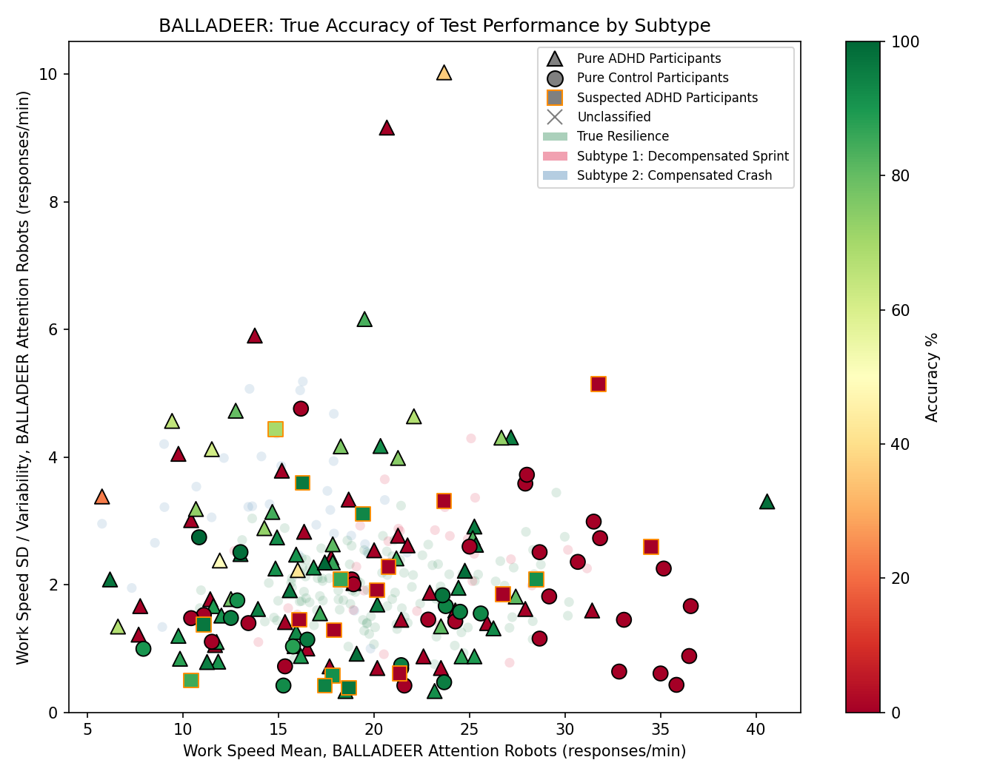

  <h1>d1d2dopamine</h1>
  
<i>Independent Researcher | Computational Neurobiology & Behavioral Data Analysis</i>

  

<table>
  <tr>
    <td width="60%" valign="top">
      <h3>◈ Academic Profile & Research Interests</h3>
      This GitHub profile serves as a living portfolio documenting my academic trajectory and research contributions. I am a neuroscientist specialized in the computational analysis of behavioral heterogeneity, with a particular emphasis on neurodevelopmental conditions like ADHD. My goals are to bridge theoretical neurobiological hypotheses with rigorous data-driven validation.  
      My current research efforts focus on: 
      • <b>Computational Psychiatry & Behavioral Trajectories:</b> Modeling task-performance decay and impulsivity trajectories (such as the "Decompensated Sprint") over time to identify robust cognitive phenotypes. 
      • <b>Exploratory Data Analysis (EDA):</b> Extracting structural patterns from high-dimensional clinical datasets using data-driven, open-science methodologies.
    </td>
    <td width="40%" align="center" valign="top">
      
    </td>
  </tr>
</table>

---

### ◈ Feature Analysis & Modelling

<table>
  <tr>
    <td width="40%" align="center" valign="top">
      
    </td>
    <td width="60%" valign="top">
      #### ▣ Quantitative Modeling Trajectories
      Complementing the impulsivity analysis (pictured above-left), I examine test performance accuracy. This second plot from the BALLADEER dataset maps performance accuracy by computational sub-clusters. It demonstrates that the identified subtypes display markedly different speed-accuracy trade-offs, which may indicate separate underlying neural mechanisms.  
      A key part of my modeling strategy involves developing reproducible statistical pipelines for open-access data. For time-based trajectory analysis of task commissions, my mixed-effects modeling formula is structured as follows:

      $$Commission_{ij} = \beta_0 + \beta_1(Block_{ij}) + \beta_2(Cluster_{i}) + b_i + \epsilon_{ij}$$
    </td>
  </tr>
</table>

---

### ◈ Featured Repository & Statistical Stack

<table>
  <tr>
    <td width="60%" valign="top">
      An exploratory analysis testing impulsivity heterogeneity on continuous-performance tasks using independent datasets (HYPERAKTIV, BALLADEER).  
      • <b>Methodology:</b> K-means clustering, Mann-Whitney U tests, mixed-effects models. 
      • <b>Focus:</b> Euclidean distance anchoring, addressing methodological circularity, and exploring potential resilience mechanisms (green clusters). 
      • <b>Repository:</b> <a href="https://github.com/d1d2dopamine/the-Allosteric-Sprint-hypothesis">View Analysis & Data</a>
    </td>
    <td width="40%" align="center" valign="top">
      
    </td>
  </tr>
</table>

 

  
  
  
  
  

---

### ◈ Contact & Collaboration
**Email:** [d1d2dopamine@gmail.com](mailto:d1d2dopamine@gmail.com)  
**Status:** Actively expanding my research portfolio. Open to academic discussions, methodological critiques, and collaborations on open-science projects.
